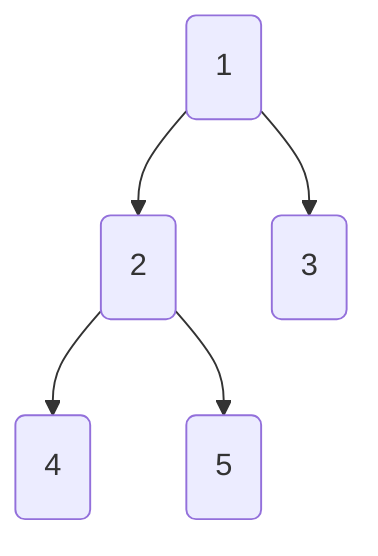
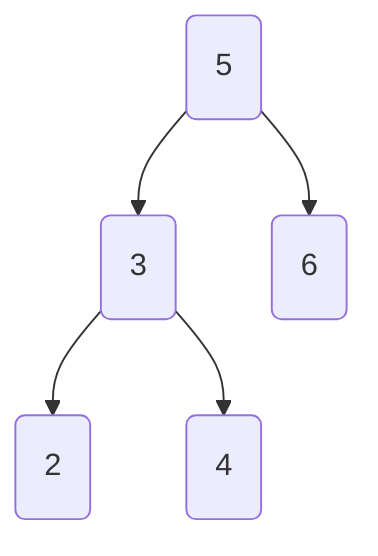

# List

## 01 Arrays

```java
int[] a = new int[]{1,2,3} // creates a 64 bit box for storing an int array @
```

## 02 IntList

### **1- Initial version**

> not practical

```java
public class IntList{
	public int first; // 1st element
	public IntList rest; // rest elements
    
    public static void main(String[] args){
        IntList L = new IntList();
        L.first = 5;
        L.rest = null;
        
        L.rest = new IntList();
        L2.rest.first = 6;
    }
}
```


### 2- with construct

```java
public class IntList{
    public int first; // 1st element
    public IntList rest; // rest elements

    // size methods
    public int size(){
        return (rest== null) ? 1 : 1 + this.rest.size();
    }
    public int iterativeSize(){
        IntList p = this;
        int cnt = 0;
        while (p!=null){
            cnt++;
            p = p.rest;
        }
        return cnt;
    }

    // get methods
    public int get(int i){
        return (i==0) ? first : rest.get(i-1);
    }
    public int iterativeGet(int i){
        IntList p = this;
        while (p != null){
            if (i == 0) {
                return p.first;
            }
            i--;
            p = p.rest;
        }
        return -1;
    }

    public IntList(int f, IntList r){
        first = f;
        rest = r;
    }

    public static void main(String[] args){
        IntList L = new IntList(15,null);
        L = new IntList(10, L);
        L = new IntList(5, L);
    }
}
```


### 3- recursive version : IntNode

> IntList is a naked linked list, which is usually hard to use. We use more IntNode as helper for other List

```java
public class IntNode {
    public int item;
    public IntNode next;
    
    public IntNode(int i, IntNode n){
        item = i;
        next = n;
    }
}
```

## 03 SLList

> An SLList is a list of integers, which hides the terrible truth of the nakedness within

### 1- initial version

```java
public class SLList {
    public static class IntNode {
        public int item;
        public IntNode next;

        public IntNode(int i, IntNode n){
            item = i;
            next = n;
        }
    }
    
    private IntNode first;
    
    
    public void addFirst(int x){
        first = new IntNode(x, first);
    }
    public int getFirst(){
        return first.item;
    }
    public void addLast(int x){
        IntNode p = first;
        while (p.next != null){
            p = p.next;
        }
        p.next = new IntNode(x,null);
    }
    // SIZE : helper + real func
    private static int size(IntNode p){
        return p.next == null ? 1 : 1 + size(p.next); 
    }
    public int size(){
        return size(first);
    }
    
    
    public SLList(int x){
        first = new IntNode(x, null);
    }
    
    public static void main(String[] args){
        SLList L = new SLList(10); // better than intNode in term of code: L = new IntNode(10, null)
        L.addFirst(10);
        L.addFirst(5);
        System.out.println(L.getFirst());

    }
}
```


### 2- improved version : size improvement

```java
public class SLList {
    public static class IntNode {...}
    
    private IntNode first;
    private int size;	// size variale
    
    public int getFirst(){...}
    public void addFirst(int x){
        size ++;	// size variable
        first = new IntNode(x, first);
    }
    public void addLast(int x){
        size ++;	// size variable
        ...
    }
    
    // SIZE : improved .ver
    public int size(){
        return size;
    }
    
    // warning : empty list may occur an error because of  p=null
    public SLList(){
        first = null;
        size = 0
    }
    public SLList(int x){
        first = new IntNode(x, null);
        size = 1
    }
}
```

### 3- improved version : empty list

> Create a sentinel Node to fix empty list bug

```java
public class SLList {
    public static class IntNode {...}
    
    private IntNode sentinel; // sentinel node instead of first
    private int size;
    
    public int size(){...}
    public int getFirst(){
        return sentinel.next.item;
    }
    public void addFirst(int x){
        size ++;
        sentinel.next = new IntNode(x, sentinel.next);
    }
    public void addLast(int x){
        size ++;
        IntNode p = sentinel;
        ...
    }
   
    
    public SLList(){
        sentinel = new IntNode(114514, null); // random value node representing sentinel node
        size = 0
    }
    public SLList(int x){
        sentinel = new IntNode(114514, null); // random value node representing sentinel node
        sentinel.next = new IntNode(x, null); // 2 nodes present in the list
        size = 1
    }
}
```

## 04 DLList

> SLList takes too many time for inserting last item => DLList (Doubl Linked List)

### 1- initial version

```java
public class DLList {
    public static class IntNode {
        public IntNode prev;	// previous node
        public int item;
        public IntNode next;

        public IntNode(int i, IntNode nextN, IntNode, prevN){
            prev = prevN;
            item = i;
            next = nextN;
        }
    }
    
    private IntNode sentinel;
    private size;
    private IntNode last;	// pointer for last node
    
    public int size(){...}
    public int getFirst(){...}
    public void addFirst(int x){
        size ++;
        sentinel.next.prev = new IntNode(x, sentinel.next, null); // N1<-->N2
        sentinel.next = sentinel.next.prev;	// Sent-->N1
    }
    public void addLast(int x){
        size ++;
        last.next = new IntNode(x,null, last.next) // N8<-->N9
        last = last.next; // Last-->N9
    }
    
    
    public SLList(){
        sentinel = new IntNode(114514, null, null);
        last = null;
        size = 0
    }
    public DLList(int x){
        sentinel = new IntNode(114514, null, null);
        sentinel.next = new IntNode(x, null, null); // sentinel point at N1
        last = sentinel.next;	// point at the last node
        size = 1
    }
}
```


### 2- improved version : with 2 sentinels

> the issue is that `last` may point at sentinel or nodes

```java
public class DLList {
    public static class IntNode {...}
    
    private IntNode sentFront; // Sentinel front
    private size;
    private IntNode sentBack;	// Senitnel last
    
    public int size(){...}
    public int getFirst(){...}
    public void addFirst(int x){
        size ++;
        sentinel.next.prev = new IntNode(x, sentinel.next, null); // N1<-->N2
        sentinel.next = sentinel.next.prev;	// Sent-->N1
    }
    public void addLast(int x){
        size ++;
        sentBack.next.next = new IntNode(x,null, sentBack.next); // N8<-->N9
        sentBack.next = sentBack.next.next; // point at the last node N9
    }
    
    
    public DLList(){
        sentFront = new IntNode(114514, null, null);
        sentBack = new IntNode(114514, null, null);
        size = 0
    }
    public DLList(int x){
        sentFront = new IntNode(114514, null, null);
        sentFront.next = new IntNode(x, null, null); // SentF-->N1
        sentBack = new IntNode(114514, sentFront.next, null); // SentB-->N1
        size = 1
    }
}
```


### 3- improved version : with circular sentinel

> only need 1 sentinel

```java
public class DLList {
    public static class IntNode {...}
    
    private IntNode sentinel;
    private size;
    
    public int size(){...}
    public void addLast(int x){
        size ++;
        sentinel.next.next = new IntNode(x, sentinel.next.next, sentinel.next); // N8<-->N9-->N1
        sentinel.next = sentinel.next.next; // Sent-->N9
        sentinel.next.next.prev = sentinel.next; // N1-->N9
    }
    
    
    public DLList(){
        sentinel = new IntNode(114514, null, null);
        size = 0
    }
    public DLList(int x){
        sentinel = new IntNode(114514, null, null);
        sentinel.next = new IntNode(x, this, this); // Sent-->N1
        size = 1
    }
}
```


## 05 AList

> previous list is good at insertion/remove, but what if we want to be good at search ?

### 1- initial version

```java
public class AList {
    private int[] items;
    private int size;
    
    public void addLast(int x){
        items[size] = x;
        size++;
    }
    public int getLast(){
        return items[size-1];
    }
    public int get(int i){
        return items[i];
    }
    public int size(){
        return size;
    }
    public int removeLast(){
        int x = getLast();
        size--;
        return x;
    }
    
    public AList() {
        items = new int[100]; // initial size = 100
        size = 0;
    }
}
```

### 2- AList with resizing (v1)

```java
public class AList {
    private int[] items;
    private int size;
    
    public int getLast(){...}
    public int get(int i){...}
    public int size(){...}
    
    public void addLast(int x){
        if (size == items.length){
            int[] a = new int[size + 1];
            System.arraycopy(items, 0, a, size);
            items = a;
        }
        items[size] = x;
        size++;
    }
    public int removeLast(){...}
    
    public AList() {...}
}
```

### 3- AList with resizing (v2)

> easier to read + test

```java
public class AList {
    private int[] items;
    private int size;
    
    public int getLast(){...}
    public int get(int i){...}
    public int size(){...}
    
    // helper func for resize
    private void resize(int capacity){
        int[] a = new int[capacity];
        System.arraycopy(items, 0, a, size);
        items = a;
    }
    public void addLast(int x){
        if (size == items.length){
            resize(size + 1) // better use resize(size * Rfactor)
        }
        items[size] = x;
        size++;
    }
    public int removeLast(){...}
    
    public AList() {...}
}
```

## 06 Comparator

> We want to compare elements for all types of variables

### 1- first approach

```java
public interface OurComparable {
   /** Return negative num if this < o.
    *  Return 0 if this equals o.
    *  Return positive num if this > o.
    */
   public int compareTo(Object o);
}

public class Dog implements OurComparable {
    private String name;
    private int size;
   
    public int compareTo(Object o){
        Dog uddaDog = (Dog) o; // convert o into Dog class
        return this.size - uddaDog.size;
}

public class Maximizer {
    public static OurComparable max(OurComparable[] items){
        int maxDex = 0;	// max element
        for (int i=0; i<items.length; i++){
            int cmp = items[i].compareTo(items[maxDex]); // compare i-element to max-element in using compareTo()
            if (cmp >0){
                maxDex = i;
            }
        }
        return items[maxDex]
    }
    
    
    
    public static void main(String[] args){
        Dog[] dogs = {...};
        Dog maxDog = (Dog) Maximizer.max(dogs);
    }
}
```

### 2- built-in approach : Comparable

> The previous approach has some limits such as : primary variables/classess have no implement OurComparable

```java
public class Dog implements Comparable<Dog> {
    private String name;
    private int size;
   
    public int compareTo(Dog uddaDog){
        return this.size - uddaDog.size;
}
    
public class Maximizer {
    public static Comparable max(Comparable[] items){
        int maxDex = 0;	// max element
        for (int i=0; i<items.length; i++){
            int cmp = items[i].compareTo(items[maxDex]); // compare i-element to max-element in using compareTo()
            if (cmp >0){
                maxDex = i;
            }
        }
        return items[maxDex]
    }
}
```

### 3- comparator : customized comparison

```java
import java.util.Comparator;

public class Dog implements Comparable<Dog> {
    private String name;
    private int size;

    public int compareTo(Dog uddaDog) {
        return this.size - uddaDog.size;
    }

    // customized comparator : by name
    public static class NameComparator implement Comparable<Dog>{
        // func to compare
        public int compare(Dog a, Dog b){
            return a.name.compareTo(b.name);
        }
    }
    
    
    public static void main(String[] args){
        Dog[] dogs = new Dogs[]{...}
        
        Dog.NameComparator nc = new Dog.NameComparator(); // instantialize comparator
        if ( nc.compare(d1, d3) > 0){
            print("d1");
        }
    }
}
```

### 4- comparator : user-friendly version

```java
import java.util.Comparator;

public class Dog implements Comparable<Dog> {
    private String name;
    private int size;
    public int compareTo(Dog uddaDog) {...}

    // customized comparator   [helper class]
    private static class NameComparator implement Comparable<Dog>{
        // func to compare
        public int compare(Dog a, Dog b){
            return a.name.compareTo(b.name);
        }
    }
    // customized comparator  [public]
    public static class Comparator<Dog> getNameComparator(){
        return new NameComparator();
    }
    
    
    public static void main(String[] args){
        Dog[] dogs = new Dogs[]{...}
        
        Comparator<Dog> nc = Dog.getNameComparator(); // Dog.NameComparator nc = new Dog.NameComparator()
        if ( nc.compare(d1, d3) > 0){
            print("d1");
        }
    }
}
```

## 07 ArraySet + Iterator + toString

> Construct an arrayset with iterator (iterator class + hasNext() + next() + implements)

### 1- ugly version of iterator

> we make our own iterator

```java
public class ArraySet<T> implements Iterable<T> {
    private T[] items;
    private int size;
    
    // helper
    private class ArraySetIterator implements Iterator<T>{
        private int pos;
        // constructor
        public ArraySetIterator() {
            pos = 0;
        }
        public boolean hasNext(){
            return pos < size;
        }
        public T next(){
            T returnItem = items[pos];
            pos++;
            return returnItem;
        }
    }
    // iterator : public
    public Iterator<T> iterator() {
    	return new ArraySetIterator;
    }

    
    public static void main(String[] args) {
        ArraySet<Integer> aset = new ArraySet<>();
        aset.add(5);

        Iterator<Integer> aseer = aset.iterator();

        while (aseer.hasNext()) {
            int i = asser.next();
            System.out.println(i);
        }
   }
}

```

### 2- ToString()

```java
public class ArraySet<T> implements Iterable<T> {
   @Override
   public String toString() {
       /*
       String returnString = "{";
       for (T item : this) {
           returnString += item.toString();
           returnString += ", ";
       }
       returnString += "}";
       return returnString;
       */
       
       // better approach : using StringBuilder
       StringBuilder returnSB = new StringBuilder("{");
       for (int i=0; i<size; i++){
           returnSB.append(items[i]).append(', ');
       }
       returnSB.append("}");
       return returnSB.toString();
   }
}
```

### 3- Equal()

```java
public class ArraySet<T> implements Iterable<T> {
   @Override
   public boolean equals(Object o) {
       if (o instanceof ArraySet oas) {
           // check sets are of the same size
           if (oas.size != this.size) {
               return false;
           }

           // check that all of MY items are in the other array set
           for (T x : this) {
               if (!oas.contains(x)) {
                   return false;
               }
           }

           return true;
       }
       // o is not an arrayset, so return false
       return false;


   }
}

```

## 08 Disjoint Sets

> intuitive version : ArrayList< Set<Integer> >    = bad for search + hard to implement

### 1- QuickFindDS

> QuickFind optimize the runtime of `isConnected()`

```java
public interface DisjointSets {
	void connect(int p, int q); 
	boolean isConnected(int p, int q);
}

public class QuickFindDS implements DisjointSets {
	private int[] id;	// id to differentiate each connected set
     
    public QuickFindDS(int N) {
     	id = new int[N];
        for (int i = 0; i < N; i++)
            id[i] = -1;	// init id
     }         

    
	public boolean isConnected(int p, int q) {
        return id[p] == id[q];
	}
	public void connect(int p, int q) {
        int pid = id[p];
        int qid = id[q];
       	for (int i = 0; i < id.length; i++) {
            if (id[i] == pid) {
                id[i] = qid;
            }
        }
    }
}
```


### 2- QuickUnionDS

> QuickUnion optimize the runtime of `connected()`

```java
public class QuickFindDS implements DisjointSets {
    private int[] parent;	// id -> (tree) indice =element|value = parent node
    public boolean isConnected(int p, int q) {...}
    
    
    public QuickFindDS(int N) {
        parent = new int[N];
        for (int i = 0; i < N; i++) {  parent[i] = -1; }
    }         
    // helper
	private int find(int p){
        int r = p;
        while (parent[r] >=0){ r= parent[r]; }  // climb the tree
        return r;
    }
    public void connect(int p, int q) {
        int i =find(p);		// find the parent of p set
        int j =find(q);		// find the parent of q set
        parent[i] = j;		// connect the 2 parents
    }
}
```


### 3- Weighted QuickUnion

> Modify quick-union to avoid tall trees. 
>
> Track tree size (**number** of elements).
>
> New rule: Always link root of **smaller** tree **to** **larger** tree.

```python
# 2 approaches possibles
1. replace -1 by -weight for root (Top approach)
2. create a separate size array   (bottom approach)

# why w instead of h ?
- same resultat but more complicated to implement
```

### 4- Weighted QuickUnion With Path Compression

> Reduce hight

```python
/*
When we connect A and B, we replace each traveled node's parent by the root 
*/
```


## 09 Binary Trees

> an unordered linked list set : perform insert/remove
>
> **problem** : hard to search



### 1- BST

> ordered linked list set : improve search capacity
>
> For every node X in the tree:
>
> - Every key in the **left** subtree is **less** than X’s key.
> - Every key in the **right** subtree is **greater** than X’s key.
>
> **problem** : insertion may cause spindly tree (↘) = brut search  [`logN -> N`]



### 2- AVL

> ordered linked list set : but rotate nodes to ensure height
>
> - The difference between L-subtree and R-subtree's height <=1
>
> **problem** : when we insert too much, the tree will need too many inter-insertion to adjust tree's structure

### 3- N-tree

> Instead of binary tree, try N-nary tree
>
> - each nodes has at most n child
> - all nodes (except root) have at least N/2 child
> - root itself not being leaf, has at least 2 child
> - all leaves are at the same depth
>
> 
>
> - n : nb of items in this node
> - p : pointer point at subtree
> - k : item

### 4-  B-trees (2-3 tree)

> good for a large items
>
> problem: when N is small, it suffer from performance problem :
>
> - maintaining different node types
> - interconversion between 2-nodes and 3-nodes
> - walking up the tree to split


### 5- LLRB tree

> - No node has two red links [otherwise it’d be analogous to a 4 node, which are disallowed in 2-3 trees].
> - Every path from root to null has same number of **black links** [because 2-3 trees have the same number of links to every leaf]. LLRBs are therefore balanced.

### 6- Red-Black Trees

> - When inserting: Use a red link.
> - If there is a *right leaning “3-node”*, we have a **Left Leaning Violation.**
>   - Rotate left the appropriate node to fix.
> - If there are *two consecutive left links*, we have an **Incorrect 4 Node Violation.**
>   - Rotate right the appropriate node to fix.
> - If there are any *nodes with two red children*, we have a **Temporary 4 Node.**
>   - Color flip the node to emulate the split operation.
>
> ! : Cascading Balance = sometimes, even 2-3 representation is correct, you still need **a rotation** to ensure LL instead of RL
>
> **problem** : with insertion, these kind of trees will still augment heights => slow 

## 10 Hashing

> We saw different implementations to make a set / map, but the problem is :
>
> 1. trees are so hard to implement
> 2. Search tree based sets are difficult to compare some objects

### 1- deriving Hash Table

Suppose we want to create a set with : add() & contains()

how can we implement it so these 2 functions' runtimes are minimal ?

#### **<u>Idea 1 : WriteOnTheWall Set</u>**

> having a big wall, just write down an element, or search the item on the wall
>
> - fast for add, but slow for search
>
> Problems :
>
> - really hard to search


#### **<u>Idea 2 : Boba Set</u>**

> split the wall by 10 sub-wall, representing 0-9.
>
> - write down the element in the corresponding wall based on the last digit
> - search in the corresponding wall
>
> Problem :
>
> - waste of space
> - what if elements are all concentrated in one sub-wall ?


#### **<u>Idea 3 : DynamicArrayOfLists Set</u>**

> keep previous idea, but use a linked list to save space ( with resize() )


#### Idea 4 : extension

> with a function to convert symbol into integer, we may extend the previous idea on all object. (with ASCII for example)
>
> problem : integer overflow [Java does not support a such big number]


#### Idea 5 : HashCode

> principle of hashcode() : 你好 = ( ascii(你) * 31^1 ) + ( ascii(好) * 31^0 ) 
>
> - with available range : -2,147,483,648 -  2,147,483,647 
>
> warning 1 : Never store objects that can change in a HashSet or HashMap!  [variables changes -> hashCode change -> data lost]
>
> warning 2 : Never override `equals` without also overriding `hashCode` [it is used by `HashMap` / `HashSet` to determine the existence of data]


## 11 Priority Queues & Heaps

### 1- 	MinPQ

> If we want to get M smallest element from N elements with its own val, how do we do ?
> Idea 1 : use ArrayList (good, but need add + sort + select M element  = O(N) memory space)
> Idea 2 : user MinPQ

```java
/** (Min) Priority Queue: Allowing tracking and removal of the
  * smallest item in a priority queue. */
public interface MinPQ<Item> {
	/** Adds the item to the priority queue. */
	public void add(Item x);
	/** Returns the smallest item in the priority queue. */
	public Item getSmallest();
	/** Removes the smallest item from the priority queue. */
	public Item removeSmallest();
	/** Returns the size of the priority queue. */
	public int size();
}


// example
public List<Particle> highestEnergyParticles(Detector det, int M) {
    	Comparator<Particle> cmptr = new EnergyComparator();
    	MinPQ<Particle> highEnergyParticles = new HeapMinPQ<>(cmptr);
    	for (Timer timer = new Timer(); timer.hours() < 24; ) {
        	highEnergyParticles.add(det.getNextParticle());
        if (highEnergyParticles.size() > M) 
           { highEnergyParticles.removeSmallest(); }
    }
    ArrayList<String> returnList = new ArrayList<String>();
    	while (highEnergyParticles.size() > 0) {
            returnList.add(highEnergyParticles.removeSmallest());
    	}
    	return returnList;
}
```


### 2- Binary min-Heap

> prob : can we find a better way ? Yes
> def : Binary tree that is **complete** and obeys **min-heap property**.
>
> - Min-heap: Every node is less than or equal to both of its children
> - Complete: Missing items only at the bottom level (if any), all nodes are as far left as possible.

|          methods           |                         description                          |
| :------------------------: | :----------------------------------------------------------: |
|    get<br>(getSmallest)    |                             easy                             |
|            add             | 1. add to the end of heap temporary <br>2. swim up the tree to the rightful place (in swaping) |
| delete<br>(removeSmaalest) | 1. swap the last item in the heap into the root<br>2. remove the older root (smallest one)<br>swim down the tree to the rightful place (in swaping) |

#### possible implementations

- **Approach 1** : create mapping from node to children
  

- **Approach 2** : Store keys and parentID in 2 arrays
  

- **Approach 3** : Store only keys in an array

  ```
  parent(k) = (k-1) /2
  ```

  

- **Approach 3bis** : leave keys[0] empty

  ```
  leftChild(k) = k*2
  rightChild(k) = k*2 + 1
  parent(k) = k/2
  ```

## 12 Graph & Tranversals

### 1- Tree transversals

> = Tree iteration

**Breadth First Traversal (BFT)** = by level order

**Depth First Traversals (DFT)** = by depth

- **Preorder** : visit a node, then traverse its children     <u>*[visit != traverse]*</u>

  - <u>use</u> : printing directory listing

  ```python
  def preOrder(BSTNode x):	# Here : DBA C FE G
      if x==null: return 
      print(x.key)
      preOrder(x.left)
      preOrder(x.right)
  ```

  

- **Inorder** : traverse left child, then right child

  ```python
  def inOrder(BSTNode x):  # Here : ABC D EFG
      if (x == null) return
      inOrder(x.left)
      print(x.key)
      inOrder(x.right)
  ```

  

- **Postorder** : traverse left, traverse right, then visit

  - <u>use</u> : gathering file sizes

  ```python
  postOrder(BSTNode x): # Here : ACB EGF D
      if (x == null) return
      postOrder(x.left)
      postOrder(x.right)
      print(x.key)
  ```

  

### 2- graph

> A set of nodes.
> A set of zero or more edges, each of which connects two nodes.

**simple graph** 

> No edges that connect a vertex to itself, i.e. no “loops”.
>
> No two edges that connect the same vertices, i.e. no “parallel edges”.

- 

**terms** :

- **vertice** : aka node
- **edge** : pair of vertices
- **adjacent** : vertices with an edge
- **labels / weights**
- **path** : sequence of vertices connected by edge
- **simple path** : path without any repetition vertice
- **cycle** : path whose 1st vertice =  -1st vertice
- 2 vertices are **connected** : if there is a path between (**connected graph** if all vertices are connected)

### 3- DFS

> supposing having a graph API
>
> ```java
> public class Graph {
>   public Graph(int V):               // Create empty graph with v vertices
>   public void addEdge(int v, int w): // add an edge v-w
>   Iterable<Integer> adj(int v):      // vertices adjacent to v
>   int V():                           // num(vertices)
>   int E():                           // num(edges)
> ...
> ```

**feature**

- Number of vertices must be **specified** in advance.
- **No support weights** on nodes or edges.
- No method for getting v.numEdge() (i.e. its degree)

**Implementation Strategy**

- `Class graph` : representing a graph
- `Class path` : to resolve graph problem

````java
public class DepthFirstPaths {
  private boolean[] marked; // if checked
  private int[] edgeTo;		// index = v, val = edgeTo
  private int s;			// starting v
 	
  public DepthFirstPaths(Graph G, int s) {
      ...					// init
      dfs(G, s);  // fill edgeTo
  }
  private void dfs(Graph G, int v) {
    marked[v] = true;			// checked
    for (int w : G.adj(v)) {
      if (!marked[w]) {
        edgeTo[w] = v;
        dfs(G, w);
      }        	
    } 
  }
  
  // methods
  // show the path
  public Iterable<Integer> pathTo(int v) {
    if (!hasPathTo(v)) return null;
    List<Integer> path = new ArrayList<>();
    for (int x = v; x != s; x = edgeTo[x]) {
      path.add(x);
    }
    path.add(s);
    Collections.reverse(path);
    return path;
  }
	// check path's available from s
  public boolean hasPathTo(int v) {
    return marked[v];
  }
}

````

**Graph representation**

- approach 1 : adjacency matrix

  - prob : when indirected graph = repetition
    

- Approach 2 : Edge sets

  ````python
  {(0,1), (0,2), (1,2)}
  ````

- Approach 3 : Adjacency Lists (most popular)

  - index = v, val = list( v.adj() )
    

### 4- BFS

> supposing having a graph API

**Implementation**

````java
public class BreadthFirstPaths {
  private boolean[] marked;
  private int[] edgeTo;
  ...
	
  private void bfs(Graph G, int s) {
  Queue<Integer> fringe = new Queue<Integer>();  // deque
  fringe.enqueue(s);
  marked[s] = true;
    
  while (!fringe.isEmpty()) {
    int v = fringe.dequeue();
    for (int w : G.adj(v)) {
      if (!marked[w]) {
        fringe.enqueue(w);
        marked[w] = true;
        edgeTo[w] = v;
      }
    }
  }
}
````

### 5 - Comparison


- In case of Adjacency Matrix : Both = O(V^2)

| type             | DFS                                    | BFS                           |
| ---------------- | -------------------------------------- | ----------------------------- |
| space efficiency | bad for spindly graph (stack)          | bad for "bushy" graph (queue) |
| path             | shortest edges (最少路线 - 无视weight) | shortest path（最短路径）     |

### 6 - Shortest path - Dijkstra's algo

**idea** : 

- Insert all vertices into fringe PQ, storing vertices in order of distance from source.Repeat: Remove (closest) vertex v from PQ, and relax all edges pointing from v.


### 7 - Shortest Path - A*

**idea** :

- Insert all vertices into fringe PQ, storing vertices in order of d(source, v) + h(v, goal).Repeat: Remove best vertex v from PQ, and relax all edges pointing from v.


## 13 Minimum Spanning Tree

### 1 - Property

```
MST = a spanning tree of minimum total weight

Given an undirected graph, a spanning tree T is a subgraph of G, where T:
- Is connected.
- Is acyclic.
- Includes all of the vertices.
```

### 2 - Cut property

```
def : Given any cut, minimum weight crossing edge is in the MST.

- cut : an assignment of a graph’s nodes to two non-empty sets.
- crossing edge : an edge which connects a node from one set to a node from the other set
```

### 3 - Prim' Algorithm

### 4 - Kruskal's Algorithm